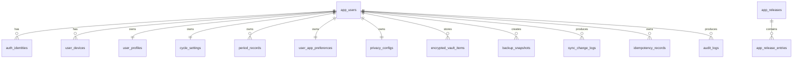

# 04 数据库设计

## 1. 数据库选择

设计基准为 PostgreSQL。字段类型使用 `uuid`、`jsonb`、`timestamptz`、`date` 和枚举类型，便于表达同步、加密元数据和审计。

## 1.1 范式设计原则

- 默认遵循第三范式：每张表只表达一个实体或一种关系，非主键字段只依赖主键，不把多个业务实体混在一张宽表中。
- 用户主状态、第三方身份、设备、资料、周期设置、经期记录、隐私配置、备份快照和审计日志必须拆表管理。
- 不为了前端一次渲染方便而把周期设置、经期记录和用户资料冗余到同一张表。
- 可枚举且稳定的值优先使用枚举类型或小整数编码，例如流量、痛感、隐私模式、同步操作类型。
- JSONB 只用于边界灵活但不作为主要关联条件的数据，例如心情标签数组、非敏感审计元数据、端到端加密附加信息。
- 对需要查询、筛选、唯一约束或关联的数据，不使用 JSONB 逃避范式设计。
- 快照表允许保存完整密文快照，因为它服务灾备恢复，不替代结构化业务表。
- 更新日志由 `app_releases` 与 `app_release_entries` 拆表维护；如果后续需要后台管理、筛选或灰度发布，应继续沿用拆表结构，不回退为单表 JSONB。

## 2. 核心表概览

| 表名 | 作用 |
| --- | --- |
| `app_users` | 用户主表 |
| `auth_identities` | 第三方身份绑定，例如微信小程序 openid |
| `user_devices` | 用户设备和会话绑定 |
| `user_profiles` | 用户资料 |
| `cycle_settings` | 周期设置与提醒配置 |
| `period_records` | 结构化经期记录 |
| `user_app_preferences` | 首页提示、空状态等轻量偏好 |
| `privacy_configs` | 用户云端隐私配置 |
| `encrypted_vault_items` | 端到端加密条目托管 |
| `backup_snapshots` | 云端备份快照 |
| `sync_change_logs` | 增量同步变更日志 |
| `idempotency_records` | 写接口幂等响应快照 |
| `audit_logs` | 安全与恢复审计日志 |
| `app_releases` | 应用更新日志 |
| `app_release_entries` | 更新日志条目明细 |

## 3. 实体关系

## 4. 关键字段说明

### 4.1 `app_users`

用户主表，只保存账户生命周期状态，不直接保存敏感资料。

| 字段 | 类型 | 说明 |
| --- | --- | --- |
| `id` | `uuid` | 用户 ID |
| `status` | `user_status` | `active` / `disabled` / `deleted` |
| `created_at` | `timestamptz` | 创建时间 |
| `updated_at` | `timestamptz` | 更新时间 |
| `deleted_at` | `timestamptz` | 软删除时间 |

### 4.2 `auth_identities`

第三方身份绑定表，第一阶段用于微信小程序登录。

| 字段 | 类型 | 说明 |
| --- | --- | --- |
| `provider` | `auth_provider` | 身份来源，例如 `wechat_miniprogram` |
| `provider_subject` | `varchar(128)` | 微信 `openid` 等第三方主体 ID |
| `union_subject` | `varchar(128)` | 微信 `unionid`，可为空 |
| `credential_hash` | `text` | 备用凭证哈希，不保存明文 |

### 4.3 `user_devices`

用户设备表，用于跨设备同步、会话管理和设备注销。

| 字段 | 类型 | 说明 |
| --- | --- | --- |
| `device_key_hash` | `text` | 客户端设备随机 ID 的哈希 |
| `platform` | `varchar(32)` | `mp-weixin`、`h5` 等 |
| `device_name` | `varchar(120)` | 用户可识别的设备名称 |
| `public_key` | `text` | 后续端到端加密设备公钥 |
| `last_seen_at` | `timestamptz` | 最近活跃时间 |
| `revoked_at` | `timestamptz` | 注销时间 |

### 4.4 `user_profiles`

用户资料表。手机号、邮箱等敏感字段不能明文保存。

| 字段 | 类型 | 说明 |
| --- | --- | --- |
| `nickname` | `varchar(80)` | 昵称 |
| `avatar_url` | `text` | 头像地址 |
| `gender` | `smallint` | 对齐前端 `Gender` 枚举 |
| `phone_ciphertext` | `text` | 手机号密文 |
| `phone_hash` | `text` | 手机号查询哈希 |
| `email_ciphertext` | `text` | 邮箱密文 |
| `email_hash` | `text` | 邮箱查询哈希 |
| `profile_ciphertext` | `text` | 端到端加密资料扩展 |

### 4.5 `cycle_settings`

周期参数与提醒配置，对齐当前 `UserSettings`。

| 字段 | 类型 | 说明 |
| --- | --- | --- |
| `avg_cycle_length` | `smallint` | 平均周期，15 到 100 天 |
| `avg_period_length` | `smallint` | 平均经期，2 到 14 天 |
| `reminder_enabled` | `boolean` | 是否开启提醒 |
| `reminder_days_ahead` | `smallint` | 提前提醒天数 |
| `reminder_time` | `time` | 提醒时间，`HH:mm` |
| `client_updated_at` | `timestamptz` | 客户端更新时间 |

### 4.6 `period_records`

- `client_record_id`：前端本地记录 ID，用于迁移和幂等。
- `start_date` / `end_date`：业务日期，`end_date = null` 表示正在进行。
- `intensity`：流量枚举，1/2/3。
- `pain_level`：痛感枚举，0/1/2/3。
- `moods`：心情标签数组，JSONB。
- `notes_ciphertext`：备注密文；如果第一阶段暂不做字段级加密，也应保留该字段语义。
- `version`：同步版本。
- `deleted_at`：软删除时间。

### 4.7 `user_app_preferences`

轻量偏好表，用于保存不适合放在用户资料里的 UI/引导状态。

| 字段 | 类型 | 说明 |
| --- | --- | --- |
| `history_entry_hint_dismissed` | `boolean` | 是否关闭历史补录提示 |
| `empty_guide_skipped` | `boolean` | 是否跳过首页空数据引导 |

当前已开放 `/api/v1/app/preferences` 和 `/api/v1/app/preferences/update`。偏好更新会写入 `sync_change_logs`，实体类型为 `user_app_preferences`。

### 4.8 `privacy_configs`

隐私配置表。只记录配置与密钥版本，不保存明文密钥。

| 字段 | 类型 | 说明 |
| --- | --- | --- |
| `storage_mode` | `privacy_storage_mode` | `plain` / `encrypted` / `e2ee` |
| `cipher_algorithm` | `privacy_cipher_algorithm` | 当前加密算法 |
| `key_version` | `integer` | 当前密钥版本 |
| `e2ee_enabled` | `boolean` | 是否启用端到端加密 |
| `recovery_enabled` | `boolean` | 是否启用恢复方案 |

### 4.9 `encrypted_vault_items`

用于端到端加密模式。服务端只知道条目类型、密钥版本、算法和密文，不理解明文内容。

| 字段 | 类型 | 说明 |
| --- | --- | --- |
| `entity_type` | `sync_entity_type` | 加密条目归属类型 |
| `entity_id` | `varchar(120)` | 客户端或服务端实体 ID |
| `algorithm` | `privacy_cipher_algorithm` | 加密算法 |
| `key_version` | `integer` | 密钥版本 |
| `nonce` | `text` | 随机数 |
| `aad` | `text` | 附加认证数据 |
| `ciphertext` | `text` | 密文 |
| `content_hash` | `text` | 密文或明文摘要，按安全方案确定 |

### 4.10 `backup_snapshots`

存储完整快照密文，可用于跨设备恢复。快照不替代结构化表，因为结构化表服务日常同步，快照服务灾备恢复。

| 字段 | 类型 | 说明 |
| --- | --- | --- |
| `client_backup_id` | `varchar(80)` | 客户端备份 ID |
| `encrypted` | `boolean` | 是否加密 |
| `algorithm` | `privacy_cipher_algorithm` | 快照加密算法 |
| `key_version` | `integer` | 密钥版本 |
| `size_bytes` | `integer` | 快照大小 |
| `snapshot_ciphertext` | `text` | 快照密文 |
| `snapshot_hash` | `text` | 快照摘要 |

### 4.11 `sync_change_logs`

增量同步日志。结构化实体变更后必须写入，用于跨设备拉取。

| 字段 | 类型 | 说明 |
| --- | --- | --- |
| `entity_type` | `sync_entity_type` | 实体类型 |
| `entity_id` | `varchar(120)` | 实体 ID |
| `operation` | `sync_operation` | create / update / delete / restore |
| `entity_version` | `bigint` | 实体版本 |
| `client_mutation_id` | `varchar(120)` | 客户端幂等 ID |
| `checksum` | `text` | 变更摘要 |

### 4.12 `idempotency_records`

幂等响应快照表。写接口首次成功后保存响应快照，重复提交同一 `client_mutation_id` 时直接返回首次响应。

| 字段 | 类型 | 说明 |
| --- | --- | --- |
| `user_id` | `uuid` | 用户 ID |
| `client_mutation_id` | `varchar(120)` | 客户端幂等 ID |
| `response` | `jsonb` | 首次处理成功后的响应快照 |
| `created_at` | `timestamptz` | 快照创建时间 |

### 4.13 `audit_logs`

安全审计表，不保存敏感正文。

| 字段 | 类型 | 说明 |
| --- | --- | --- |
| `action` | `varchar(80)` | 操作名称 |
| `resource_type` | `varchar(80)` | 资源类型 |
| `resource_id` | `varchar(120)` | 资源 ID |
| `success` | `boolean` | 是否成功 |
| `ip_hash` | `text` | IP 哈希 |
| `user_agent_hash` | `text` | UA 哈希 |
| `metadata` | `jsonb` | 非敏感元数据 |

### 4.14 `app_releases` 与 `app_release_entries`

应用更新日志表，用于后端动态下发已发布版本说明。当前已开放 `/api/v1/app/releases` 和 `/api/v1/app/releases/detail` 只读接口，只返回 `published=true` 的版本。

`app_releases` 保存版本主信息：

| 字段 | 类型 | 说明 |
| --- | --- | --- |
| `version` | `varchar(40)` | 版本号 |
| `released_at` | `date` | 发布日期 |
| `title` | `varchar(120)` | 标题 |
| `summary` | `text` | 摘要 |
| `published` | `boolean` | 是否发布 |

`app_release_entries` 保存版本条目明细，避免版本主表出现重复条目数组：

| 字段 | 类型 | 说明 |
| --- | --- | --- |
| `release_id` | `uuid` | 所属版本 |
| `entry_type` | `varchar(40)` | `feature` / `improvement` / `fix` / `security` |
| `content` | `text` | 条目内容 |
| `sort_order` | `integer` | 展示排序 |

## 5. 索引与约束

- `auth_identities(provider, provider_subject)` 唯一。
- `period_records(user_id, client_record_id)` 唯一。
- `sync_change_logs(user_id, client_mutation_id)` 唯一。
- `idempotency_records(user_id, client_mutation_id)` 唯一。
- `period_records(user_id, start_date)` 普通索引，用于日历和同步。
- `backup_snapshots(user_id, created_at desc)` 普通索引。
- `idempotency_records(user_id, created_at)` 普通索引，用于后续清理历史幂等快照。
- 周期记录重叠校验建议在服务层完成；PostgreSQL 可后续升级为 daterange 排他约束。
- `app_release_entries(release_id, sort_order)` 普通索引，用于更新日志按顺序展示。

## 6. 当前功能对应表

| 当前小程序功能 | 后端表 |
| --- | --- |
| 本地用户资料 | `app_users`、`auth_identities`、`user_profiles` |
| 平均周期、平均经期 | `cycle_settings` |
| 经期历史记录 | `period_records` |
| 首页空状态/补录提示关闭 | `user_app_preferences` |
| 本地备份快照 | `backup_snapshots` |
| 隐私加密配置 | `privacy_configs`、`encrypted_vault_items` |
| 跨设备同步 | `sync_change_logs`、`idempotency_records` |
| 恢复和安全追踪 | `audit_logs` |
